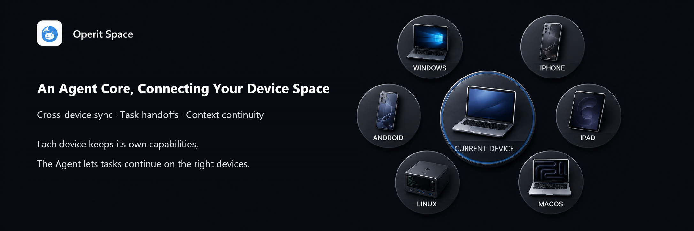

<h1 align="center"> Operit2</h1>
<p align="center"><a href="README.md">English</a> · <a href="README-zh.md">简体中文</a></p>
<p align="center"><sub>An Agent core that connects your device space.</sub></p>
<p align="center"><strong>Preview Release</strong> · <a href="docs/Operit2-Technical-Whitepaper.pdf">Read the technical whitepaper</a></p>

<p align="center">
  
</p>

Operit2 is an open-source, cross-device Agent project for personal users. It aims to let phones, desktops, and cloud devices each play to their strengths, so conversations, tasks, and context can continue across a personal device space.

The project grew out of Operit's Android Agent practice and is currently refining multi-device synchronization, cross-device execution, and recovery experiences. The project's original motivation, engineering architecture, and long-term direction are described in the [Operit2 technical whitepaper](docs/Operit2-Technical-Whitepaper.pdf).

> During the preview stage, the underlying structure, data formats, plugin contracts, and cross-device workflows may still undergo breaking changes.

## How Devices Work Together

Each instance running Core is called a `CoreNode`. It uses capabilities such as files, terminals, and browsers through its local `Host`. `Space` organizes collaboration and persistent synchronization between nodes, while `Binding` records which node continues the task next.

Nodes in a Space have equal standing. A Linux cloud device may handle more tasks because it is always online or has suitable capabilities, but it does not thereby become a fixed primary node. Joining a Space does not automatically grant a node the system permissions of other devices.

Task handoff is bounded by the point at which the tool result has been persisted and the next model request has not yet started. After the target node obtains the required synchronization records, it continues the work. This continuation relies on saved context and task facts; it does not move an in-progress model request, terminal process, or browser session.

We hope to gradually deliver an experience like this: start a task on a phone, let a suitable device continue executing it, view or approve it on a desktop, and finally return to the phone to receive the result. The primary conversation retains the interaction ownership of the originating device, subtasks advance on the execution node, and other devices learn about progress through asynchronous synchronization. The complete experience is still being developed.

## Current Capabilities

### Single-node Agent

Each CoreNode can run its own Agent workflow independently. Its capabilities depend on the platform Host, model Provider, and local configuration. The current repository already includes:

- Conversations, session branches, message management, attachments, character cards, character groups, and prompt configuration;
- Provider configuration, model parameters, tool calls, request queues, and local model directories;
- Workspaces, file operations, project templates, commands, and backup/import/export;
- Terminal sessions, PTY input, and output streams;
- Web access, browser automation, workspace browsers, and runtime WebView session projections;
- Memory, summarization, speech recognition, speech synthesis, and other built-in tools.

These capabilities are not identical across all platforms. Whether an operation can actually be executed depends on the target node's Host description, system permissions, installed services, and current user approval.

### Multi-node Connections and Space

The CLI already provides entry points for pairing, discovery, connection, sessions, transport methods, and Space member management. Nodes establish authenticated connections through Link Access, and PeerLink then carries Space requests and synchronization traffic. It is suitable for experimentation on a local or controlled LAN:

```powershell
operit2 cli link serve --bind <address:port> --token <strong-token>
operit2 cli link discover
operit2 cli link connect <url> --token <token> --save <session-name>
operit2 cli link space join <session-name>
operit2 cli link space show
```

Use the actual output of `operit2 --help` and `operit2 cli` as the source of truth for command parameters. Do not listen on the public internet with the default development token, and do not put tokens, private keys, or real business data into public logs or screenshots.

### Plugins, Skill, ToolPkg, and MCP

Operit2's extension surface has gradually been abstracted from a "built-in tool collection" into manageable runtimes and SDKs:

- Write Packages and ToolPkgs in JavaScript/TypeScript;
- Build tools and UIs with the JavaScript bridge, Wasm runtime, and Compose DSL;
- Use Skills to provide importable workflows and knowledge resources with controllable visibility;
- Connect to MCP servers and manage MCP configurations, tools, and local MCP processes;
- Use the plugin marketplace and package-manager commands to install, enable, disable, inspect, and execute extensions;
- Use the Rust SDK, TypeScript declarations, and codegen as plugin development entry points; these interfaces are still evolving.

Going forward, runtime, Host capabilities, permissions, compatibility versions, and state-scope declarations will be further refined so that extensions can run or continue on compatible nodes. For now, validate plugins and their dependencies on the target platform; cross-device portability remains a major development focus.

The plugin author entry point is [`plugins/docs/README.md`](plugins/docs/README.md), and the public SDK documentation is in [`core/crates/plugin/sdk/README.md`](core/crates/plugin/sdk/README.md).

### Web Access

Web Access lets a browser access a running CoreNode; opening the page does not automatically make the browser an independent node in the Space. The browser Host and the WebAssembly runtime are separate engineering paths, and their capabilities and deployment methods should be considered separately.

See "Web Access Development" below for local development, and [`apps/web_access/README.md`](apps/web_access/README.md) for access and deployment instructions.

### Data Backup and Migration

Operit2 treats migration as part of personal-device continuity. The CLI already provides entry points for identity, storage paths, snapshot export/restore, backup inspection, and Operit v1 snapshot inspection:

```powershell
operit2 cli identity list
operit2 cli storage paths
operit2 cli export snapshot <snapshot.zip>
operit2 cli backup inspect <snapshot.zip>
operit2 cli backup restore <snapshot.zip>
```

The exact scope of snapshots, configuration, and identity data is determined by the current command help and format version. Active processes and live sessions remain with the original node; having a backup must not be understood to mean that all runtime state can already be migrated seamlessly.

## Platforms and Access Surfaces

| Entry or platform | Role in the current architecture | Current boundary |
| --- | --- | --- |
| Flutter App | The primary graphical access surface for mobile and desktop, and it can also host a CoreNode | Host and build conditions differ across Android, Windows, Linux, macOS, iOS, OpenHarmony, and Web |
| Rust CLI/TUI | Local CoreNode and operations/development entry point | The current CLI Host mainly covers Windows, Linux, and macOS |
| PB_SBC01_H3 | Linux hardware control entry point for running a complete Core | Uses Linux Host capabilities together with board Host capabilities; the application entry point is `apps/pb_sbc01_h3` |
| Web Access | Browser entry point for accessing a running CoreNode | Not a browser node that automatically joins the Space, and not a centralized Agent Server |
| WebAssembly/browser Host | Local capability boundary of the browser runtime | Separate from the Web Access surface; exact capabilities depend on the browser and current Web build mode |
| Linux cloud device | Ordinary CoreNode in a Space | Can handle more tasks when it is always online, but does not thereby gain a central identity |
| ESP32 Edge Node | Device-side Edge Service capability node | Not a complete CoreNode; it does not hold OperitApplication, Chat, Store, Identity, or Space synchronization |
| Server | Future deployment form and Host direction | The current repository does not yet contain a complete Server product that can be published directly |

The repository contains Host adaptation paths for multiple platforms, but "can build" does not mean that cross-device interoperability has been validated. Follow [`BUILDING.md`](BUILDING.md) and the corresponding workflows for platform build, signing, and release conditions.

## User Control and Security Boundaries

Operit2 uses a capability model that tightens layer by layer from the outside in:

```text
0. App Runtime Sandbox
   Virtual machine, container, system account, Android application sandbox, or server deployment boundary

1. Host Authorization
   File, terminal, network, and system capabilities actually granted to the local Host by the operating system

2. AI Capability Limit
   The ReadOnly, WorkspaceWrite, or Full capability mode selected by the user for the AI

3. User Tool Approval
   The user's allow, ask, or deny decision for a specific tool call
```

Several principles must be preserved:

- Space membership does not grant other nodes the ability to read local files, use the local terminal, or obtain administrator/root capabilities;
- API keys, device private keys, pairing keys, sessions, and local platform permissions belong to the node locally by default and are not automatically copied by joining a Space;
- `Full` only means that AI capability limits are relaxed; it does not elevate Host privileges or create capabilities that the operating system does not have;
- An application's internal sandbox fields and UI must not be presented as real operating-system-level isolation boundaries;
- Before exposing Link or Web Access externally, use a strong token, a restricted listen address, TLS/firewall protection, and redacted logs;
- The user always retains the decision of whether to synchronize sensitive data, approve a specific action, or let a node participate in collaboration.

See [`docs/permission-access-architecture.md`](docs/permission-access-architecture.md) and [`hosts/README.md`](hosts/README.md) for the complete boundary description.

## Preview Stage and Direction of Evolution

Rust Core, platform Hosts, node connections, persistent synchronization, and the plugin runtime have established an engineering foundation. The current priority is to fix issues and improve stability, especially cancellation, reconnection, resource release, and failure recovery for cross-device execution.

The following directions are still being designed, refined, or validated:

- Combine node health (Health), long-running execution records, and user preferences to select suitable devices;
- Introduce fallback nodes, controlled parallelism, and subtask splitting for suitable tasks;
- Improve compatibility declarations and cross-node continuation for the plugin SDK;
- Improve the experience of adding new devices, recovering data, and running long-lived deployments;
- Validate the discovery, routing, and synchronization costs as the number of nodes increases.

The current focus is personal device spaces. Scheduling across thousands of nodes has not been validated, and enterprise organization governance is not a product goal. Long-running quality still requires continued testing; Rust itself does not guarantee the absence of resource leaks. See the [technical whitepaper](docs/Operit2-Technical-Whitepaper.pdf) for more detailed design trade-offs.

## Quick Start

### Requirements

Common development entry points require:

- Rust stable and rustup;
- Flutter SDK and FVM for the Flutter App;
- Node.js for the Web Access development proxy;
- Python 3 for build, release, and helper scripts;
- Native build tools for the corresponding platform.

See [`BUILDING.md`](BUILDING.md) for complete environment, signing, release, and platform differences. Do not commit signing files, API keys, or release tokens to the repository.

### CLI/TUI

Run from the repository root:

```powershell
cargo check --manifest-path apps/cli/Cargo.toml
cargo run --manifest-path apps/cli/Cargo.toml --bin operit2 -- --help
cargo run --manifest-path apps/cli/Cargo.toml --bin operit2 -- cli version
cargo run --manifest-path apps/cli/Cargo.toml --bin operit2 -- tui
```

With no arguments, `operit2` enters the TUI by default. View more entry points with:

```powershell
cargo run --manifest-path apps/cli/Cargo.toml --bin operit2 -- cli
cargo run --manifest-path apps/cli/Cargo.toml --bin operit2 -- cli link
cargo run --manifest-path apps/cli/Cargo.toml --bin operit2 -- cli web
```

### Flutter App

Run from the `apps/flutter/app` directory:

```powershell
fvm install --skip-pub-get
fvm dart pub get --enforce-lockfile
fvm flutter analyze
fvm flutter run -d windows
```

`windows` is only an example device name. Android, Linux, macOS, iOS, OpenHarmony, and browser modes each require their own platform toolchains, and their Host capabilities are not identical.

### Web Access Development

Local Flutter Web development requires two terminals:

```powershell
# Terminal 1: apps/flutter/app
fvm flutter run -d web-server --web-hostname 127.0.0.1 --web-port 4835

# Terminal 2: repository root
node tools/dev_web_access_proxy.mjs --upstream-port 4835 --listen-port 4836
```

Then open `http://127.0.0.1:4836`. If a port is already in use, you can change the Flutter upstream port and the proxy's `--upstream-port` at the same time, but keep the two values identical.

## Repository Structure

```text
apps/
├── cli/                 Rust CLI/TUI entry point
├── pb_sbc01_h3/         PB_SBC01_H3 hardware control entry point
├── flutter/app/         Flutter App entry point
├── web_access/          Web Access frontend boundary and shared bundle
└── server/              Reserved directory for the Server form

core/
├── crates/              Rust Core domain crates
├── CRATE_BOUNDARIES.md  Crate dependency directions and responsibility boundaries
└── examples/            Provider and plugin SDK examples

hosts/                   Android, Windows, Linux, Apple, Web, and board Host implementations
plugins/                 ToolPkg, Skill, SDK types, and plugin development tools
tools/                   Build, release, Web, and development helper scripts
docs/                    Architecture, permission, Link, migration, and version documentation
```

## Documentation

- [Build and release](BUILDING.md)
- [Contributing guide](CONTRIBUTING.md)
- [Core crate boundaries](core/CRATE_BOUNDARIES.md)
- [Core domain structure](core/crates/README.md)
- [CoreNode, Space, and Binding](docs/core-node-space-binding-architecture.md)
- [Link, Access, and Space boundaries](docs/link-access-architecture.md)
- [Permission, AI capability, and sandbox boundaries](docs/permission-access-architecture.md)
- [Platform Host implementation boundaries](hosts/README.md)
- [Web Access frontend and deployment requirements](apps/web_access/README.md)
- [Plugin author documentation](plugins/docs/README.md)
- [Versions, tags, channels, and release assets](docs/release-versioning.md)
- [Current crate split and migration plan](docs/core-module-crate-layout.md)

Architecture documents that are marked as a "target", "plan", or "direction of evolution" do not mean that all platforms have implemented them. To determine current actual behavior, use the source code, command help output, build results, and runtime results on the target platform as the source of truth.

## Contributing

Operit2 is still a long-term engineering project. We welcome code, documentation, tests, platform Hosts, plugins, Skills, MCP integrations, and real-world usage feedback.

If you modify cross-device capabilities, try to preserve these three boundaries:

1. Local Host permissions are not automatically inherited through Space membership;
2. Users must be able to understand the synchronization scope and data ownership;
3. Features may evolve, but the continuity of the user's tasks and recoverable records must not be silently lost.

Read [`CONTRIBUTING.md`](CONTRIBUTING.md) before getting started. For changes involving protocols, persistence, Binding, Host capabilities, or plugin contracts, also update the corresponding architecture documentation and tests.

## License

The [`LICENSE`](LICENSE) in the repository root is currently the GNU Affero General Public License v3.0 (AGPL-3.0). Specific crates, plugins, ToolPkgs, Web bundles, vendored code, and third-party dependencies may carry their own licenses or metadata; check the declarations in the relevant component directory before using, distributing, or modifying a specific component.
